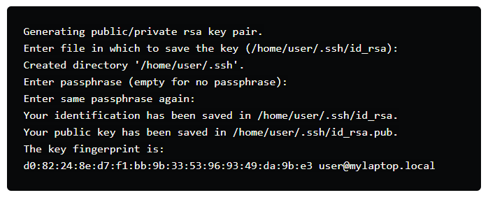
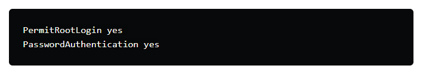

# DigitalOceanKeyError
¿ Está tratando de acceder a su gotita de DigitalOcean y no puede ir más allá Permission denied (publickey)?

Esto podría deberse a múltiples razones, tener una entrada de clave pública incorrecta en su droplet authorized_keyso crear una nueva clave pública en su sistema que el droplet aún no reconoce.

Después de probar las cosas habituales, esto es lo que funciona:

1-Si ha creado una nueva clave pública SSH, ejecute: cat ~/.ssh/id_rsa.pub en su sistema local y copie la clave completa que muestra. [Pase al punto 2] En caso de que no muestre nada, probablemente no tenga una clave SSH pública o podría tener una con un nombre diferente. Vaya a cd .ssh y vea si tiene alguno de los *.pubarchivos allí, si desea usar alguno de esos, simplemente ejecute cat filename.pub y copie la clave. Si no tiene ninguna clave SSH pública existente, puede generar una usando: ssh-keygen -o y luego siga las instrucciones que se muestran.

Una vez que se genera la clave pública, visualícela usando cat ~/.ssh/id_rsa.pubo reemplácela id_rsa.pubcon el nombre que le haya dado al archivo. Ahora copia esa clave.

1. Ahora diríjase a su consola web digitalocean. Vaya a Configuración > Seguridad > Claves SSH > Agregar clave SSH. Agregue la clave SSH que copió y asígnele cualquier nombre.
Tenga en cuenta que si la clave ya existe, no se copiará, por lo que puede omitir este paso.
Ahora intente conectarse a través de SSH, si funciona, tiene suerte. Si no funciona, para eso estás aquí.
2. Dirígete al tablero de tu droplet y desde las opciones del lado izquierdo, selecciona Acceso > Acceso a la consola > Iniciar consola.
Ingrese su nombre de usuario y contraseña para el droplet, y lo conectará al droplet a través de SSH (usando un navegador web).
3. Deberá habilitar el inicio de sesión con contraseña en su droplet. Para hacerlo sudo nano /etc/ssh/sshd_config, desplácese hacia abajo y configúrelos en yes

Guarde el archivo y ejecute
**_service sshd restart_**
para reiniciar el servicio sshd y aplicar los cambios.

1. Ahora, algunos artículos pueden sugerir dirigirse al ~/.ssh/authorized_keys droplet desde la consola SSH del navegador, pero tiene un error que solo copia la clave SSH hasta ciertos caracteres, y debido a eso, no funcionará. Por lo tanto, no haremos este paso ahora .
2. Como ha habilitado la autenticación de contraseña en el servidor, intente SSH desde el terminal, le pedirá la contraseña, después de lo cual debería poder conectarse. Bueno, problema resuelto, o al menos la mayor parte.
3. Ahora vamos a editar el nano ~/.ssh/authorized_keysarchivo en el servidor, pegue su clave SSH aquí en una nueva línea (que generó en el Paso 1). Ahora puede reiniciar el servicio ssh nuevamente usando service sshd restart.
